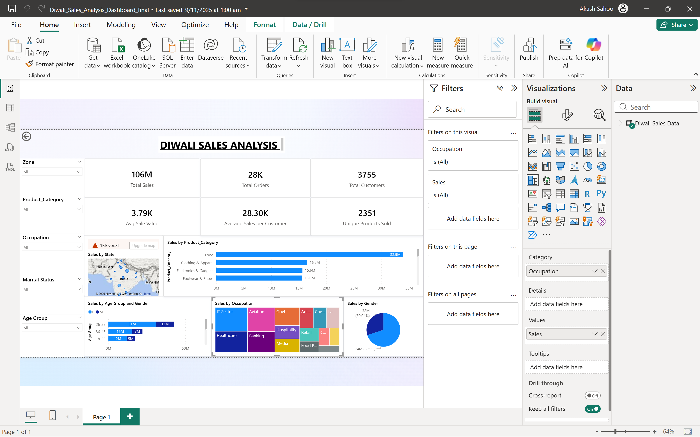

# Diwali Sales Data Analysis

## Project Overview
This project involves an Exploratory Data Analysis (EDA) of Diwali sales data to extract actionable business insights and identify key customer purchasing behaviors. The analysis was conducted using Python and Pandas within a Jupyter Notebook environment.

## Objectives
* Clean and preprocess the raw sales data.
* Analyze customer demographics (age, gender, marital status, occupation).
* Identify top-performing product categories and geographical regions.
* Provide data-driven recommendations to optimize future marketing and inventory strategies.

## Key Insights Discovered
* **Demographics:** The `26-35` age group contributed the most to overall sales.
* **Gender:** Female customers generated significantly higher sales volume compared to male customers.
* **Marital Status:** Unmarried customers contributed a higher percentage of sales than married customers.
* **Top Occupations:** Customers working in the `IT Sector`, `Healthcare`, and `Aviation` drove the highest purchasing amounts.
* **Top Regions:** `Uttar Pradesh`, `Maharashtra`, and `Karnataka` emerged as the highest-performing states for sales.
* **Top Products:** `Food`, `Clothing & Apparel`, and `Electronics & Gadgets` were the best-selling product categories.

## Business Recommendation
Based on the data, future marketing campaigns and inventory stocking should heavily target **unmarried females aged 26-35 working in the IT, Healthcare, and Aviation sectors**. Geographical ad spend should be prioritized in Uttar Pradesh, Maharashtra, and Karnataka, with a focus on promoting Food, Apparel, and Electronics.

## Interactive Dashboard
To provide a clear, high-level overview of the sales data and demographics, an interactive dashboard was built using Power BI.

## Author
Akash Kumar Sahoo
